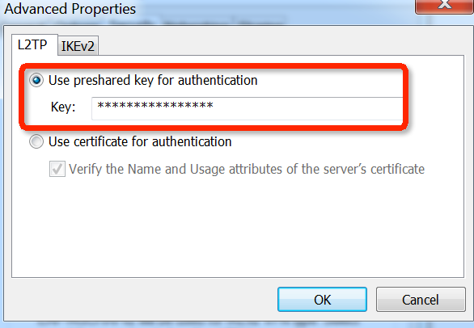

#Connect to my VPN Server based on L2TP/IPsec

Bacically I provide a VPN service based on L2TP/IPsec with a machine in my appartment. You can connect it with iOS, Mac OS, Windows, Android, Linux and so on.  
This is a guidance is about how to connect to my server([arsread.wicp.net](http://arsread.wicp.net)). For getting username, password and pre-shared key, please contact me.

Note:
Currently my server is set to open everyday from 6:30 to 20:00 CET, which in China Standard Time is 12:30 to 2:00 next day. 

##iOS (iOS 7)

Open Settings -> General -> VPN -> Add VPN Configuation, fill in the blanks as below:

  

In which **Account** is the username, **Password** is the password, and **Secret** is the pre-shared key.

Go back to Settings, switch on the "VPN" button and hence get connected.

##Mac OS (10.9)

1. Open network preference.

    
    
2. Click "+" to add a new VPN connect.

    
    
3. Fill in **Server Address** with *arsread.wicp.net*, **Account Name** with username. Click **Authentication Settings**, fill **Password** and **Shared Secret**.
4. Click OK, then click **connect** int the pannel.

##Android (4.x)
1. Go to Settings > Wireless & networks > VPN settings > Add VPN > Add L2TP/IPSec PSK VPN
2. Fill in the blanks:
   - Name: Any name you like
   - Type: L2TP/IPSec PSK
   - Server address: arsread.wicp.net
   - IPSec preshared key: the pre-shared key
3. Press back, then connect using the username/password

Attention:
According to [related issues](https://code.google.com/p/android/issues/detail?id=23124), it may not be available to connect to l2tp VPN from Android. Try [#264 reply](https://code.google.com/p/android/issues/detail?id=23124#c264) of the issue and see if it works.

##Windows (Windows 7)
1. Open Network and Sharing Center.  

    

2. Set up a new connection or network.

    

3. Connect to a workplace.

    
    
4. Click "Use my Internet connection(VPN)"
5. Type "arsread.wicp.net" in Internet address and name the Destination name as you want. Remembet to check the "Don't connect now"
    
    
    
6. Enter the username and the password then close it.
7. Open the properties of the setting.
    
    
    
8. Choose "Advanced settings" in the "Security" tab.
    
    

9. In "L2TP" tab, chose "Use preshared key for authtication" and enter the pre-shared key.

	
	
10. Press "OK" and connect it from the pannel(should input the password again).

	
	
Attention:
If you are not able to connect, try the following:
- According to [Microsoft's official document](http://support.microsoft.com/kb/926179), modify the regisry subkey, in my case, to 2.   
- If above solution doen't work, try to turn off the firewall.

##Linux(Ubuntu)
In Ubuntu a possible to set up VPN client connection is to install l2tp-ipsec-vpn. There is a [guidance](https://my.hostvpn.com/knowledgebase/11/L2TPorIPSec-Connection-from-Ubuntu-Desktop-1204.html) about how to install it. Believe that it is not too difficult for a linux user, hence no more details here :)

Attention:
In my case there will be some trouble connecting by l2tp-ipsec-vpn. If so, try [this solution](https://answers.launchpad.net/l2tp-ipsec-vpn/+question/183813) by modifying *"connection_name".options.xl2tpd*.
